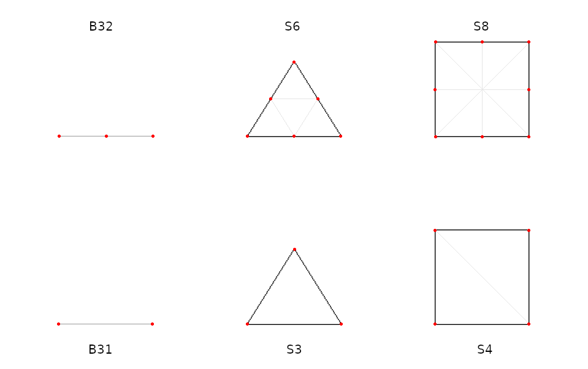
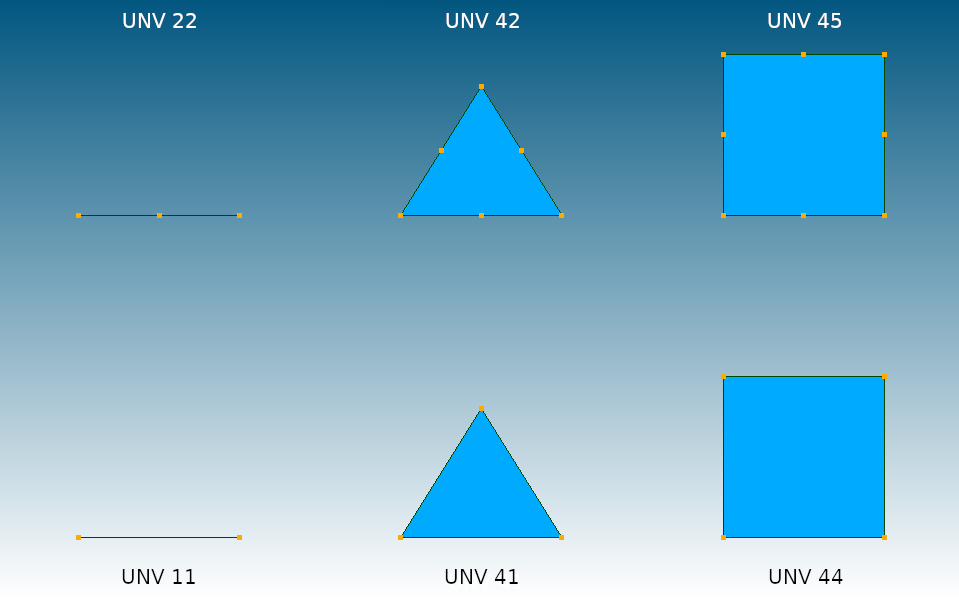
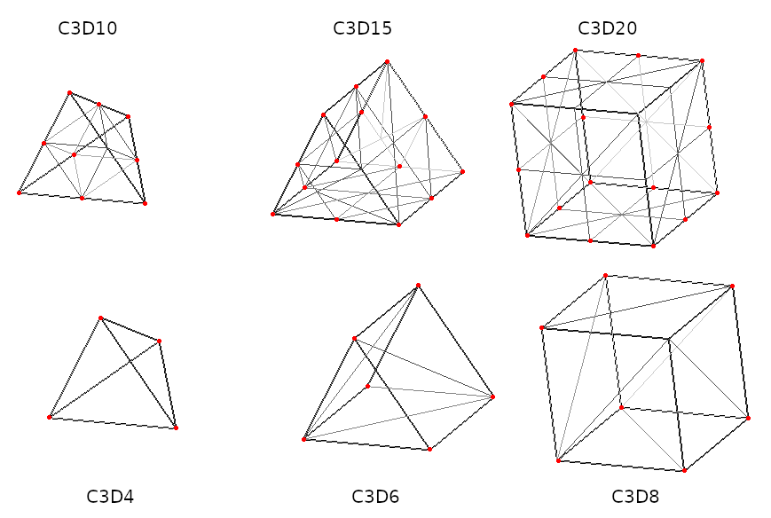
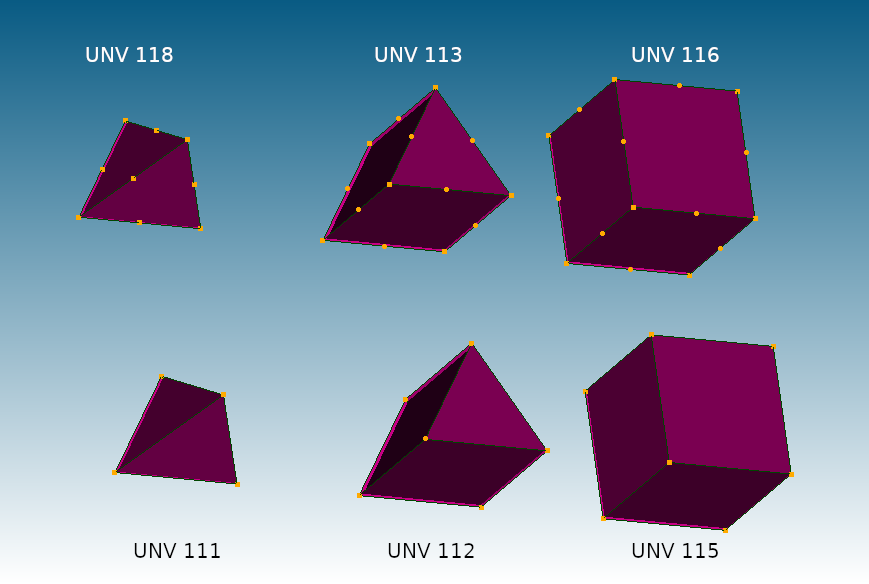

© Ihor Mirzov, 2023  
Distributed under GNU General Public License v3.0

  

---

[How to use](#how-to-use) |
[Screenshots](#screenshots) |
[Your help](#your-help) |
[TODO](#todo)

---

  

# CalculiX to Salome converter (inp to unv)

Converts [CalculiX](http://dhondt.de/) .inp file to [Salome](https://www.salome-platform.org/) .unv format.

  

# How to use

Python3 is needed.

Result UNV-file name is the same as INP-file name. So only one argument should be passed to the converter:

    python unv2ccx.py file.inp

  

# Screenshots

1D and 2D elements in CalculiX GraphiX:  

Converted 1D and 2D UNV elements in Salome:  

3D elements in CalculiX GraphiX:  

Converted 3D UNV elements in Salome:  

  

# Your help

Please, you may:

- Star this project.
- Simply use this software and ask questions.
- Share your models and screenshots.
- Report problems by [posting issues](https://github.com/calculix/inp2unv/issues).
- Or even [become a sponsor to me](https://github.com/sponsors/imirzov).

  

# TODO

- Support keyword *HEADING
- Support keyword *SURFACE
